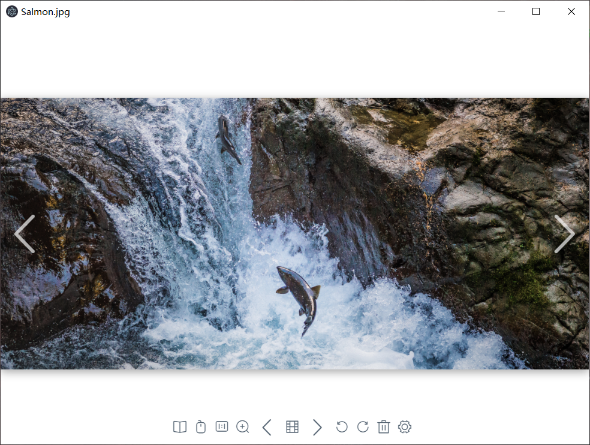

# ChamageViewer - 猹图 更新2.4版本！代码进一步优化！



一款Electron+Vue开源Windows图片查看器

> 引言：Win10自带的图片查看器用起来非常不便， 而目前比较好用的几款又有流氓弹窗、付费解锁等等诸多问题
> 本着干净、多元、造轮子的基本思想，用Electron+Vue开发了这款开源图片猹看器 希望能改善图片浏览体验
>
> 目前这款软件依然在努力开发中，有诸多问题尚待解决优化
>
> 感谢支持与热爱

### 特性
+ 基于electron+vue开发，完全开源
+ 丝滑的缩放动画与拖动阻尼感
+ 本地漫画浏览模式，自动拼接单图
+ 以及更多！


## 如何使用
下载地址：[国外源](https://github.com/GinirohikoCha/ChamageViewer/releases) [国内源](https://gitee.com/GinirohikoCha/ChamageViewer/releases)
```
设置为默认应用或直接将图片拖至图标上
```

## 项目计划
+ ~~漫画模式~~
+ 全屏模式
+ 文件夹穿透
+ 按键编辑
+ 优化速度
+ 图片处理
+ 社区插件
+ 以及更多……

## 项目构建

### Install Dependence
```
npm install
```

#### Compiles and hot-reloads for development
```
npm run electron:serve
```

#### Compiles and minifies for production
```
npm run electron:build
```

#### Lints and fixes files
```
npm run lint
```

#### Customize configuration
See [Configuration Reference](https://cli.vuejs.org/config/).
